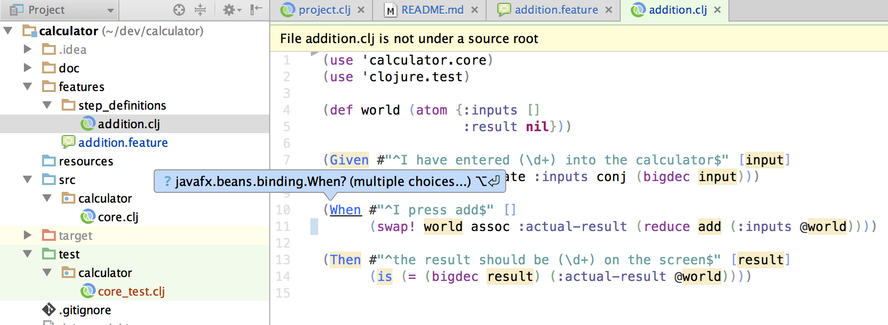
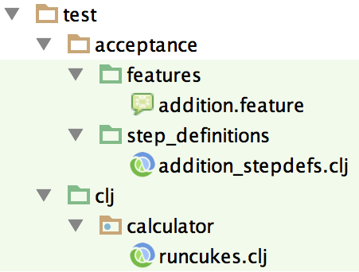

# BDD guide for Clojure projects 

First of all, because we never say "thank you" enough, kudos to:
 
- Rich Hickey for [Clojure](http://clojure.org) for which I have no words strong enough to praise.
- Colin Fleming for [Cursive](https://cursiveclojure.com) which totally rocks.
- Aslak Hellesøy for [cucumber-jvm](https://github.com/cucumber/cucumber-jvm) which is a very useful tool to write much better software.
- Phil Hagelberg for [Leiningen](http://leiningen.org) which does so much for you.
- Nils Wloka for the [leiningen-cucumber](https://github.com/nilswloka/lein-cucumber) plugin which helped me getting started. 

I'll walk you through a very simple example to demonstrate how you can do BDD in Clojure with the tools above.
The main objective of this repo is to have a minimalistic example for Colin to improve support for cucumber-jvm 
in Cursive (Colin, check out the end of this README for the wishlist !). 

## Step 1 - Install plugins

Install the "Gherkin" and "Cucumber for Java" plugins from Jetbrains plugin repository.
Detailed instructions here: https://www.jetbrains.com/idea/help/cucumber.html

## Step 2 - Launch BDD tests with Leiningen

First, create a fresh new project:

``` bash
lein new calculator
``` 

Create a `features` folder and add a new file named `addition.clj` in that folder with the following content: 

``` gherkin
Feature: Addition
  In order to avoid silly mistakes
  As a math idiot
  I want to be told the sum of two numbers

  Scenario: Add two numbers
    Given I have entered 50 into the calculator
    And I have entered 70 into the calculator
    When I press add
    Then the result should be 120 on the screen
```

Since you've installed the Gherkin plugin you should have syntax highlighting and a nice little Cucumber icon for the feature file.

Now, let's implement this scenario. We have to create the glue (called step definitions) which will link the
BDD text to our future code. Add a folder under `features` called `step_definitions` and create a file 
named `addition.clj` in the `features/step_definitions` folder: 

``` clojure
(use 'calculator.core) ;; yes, no namespace declaration
(use 'clojure.test)

(def world (atom {:inputs []
                  :actual-result nil}))

(Given #"^I have entered (\d+) into the calculator$" [input]
       (swap! world update-in [:inputs] conj (bigdec input)))

(When #"^I press add$" []
      (swap! world assoc :actual-result (reduce add (:inputs @world))))

(Then #"^the result should be (\d+) on the screen$" [result]
      (is (= (bigdec result) (:actual-result @world))))
```
 
It's time to implement the complex mechanic of our calculator. 
Update `calculator.core` to look like this :

``` clojure
(ns calculator.core)

(def add
  "Adds numbers"
  +)
```

Add the [lein-cucumber](https://github.com/nilswloka/lein-cucumber) plugin to your `project.clj`:

``` clojure
:plugins [[lein-cucumber "1.0.2"]]
```

Note that contrary to what is explained on the [cucumber-jvm clojure how-to](https://github.com/cucumber/cucumber-jvm/tree/master/clojure) page, you don't need to add an entry point as a `clojure.test`. We'll do that in the next step instead.

Now open a command prompt and type `lein cucumber`, it should produce the following:

```
Running cucumber...
Looking for features in:  [features]
Looking for glue in:  [features/step_definitions]
....
```

The 4 points above indicate that the test are passing. Well done!

Note: The BDD example was taken from the official [Cucumber website](http://cukes.info).


## Step 3 - Edit the glue file with Cursive

At that point, `addition.clj` looks like this in Cursive: 



There are two issues:
- A warning message in the top yellow box saying `File addition.clj is not under a source root'.
- Cursive suggest to import some When class from javafx.

Both are easy to fix. To ged rid of the warning message, add this to your `project.clj`:

```
:test-paths ["features" "test"]
```

Click the refresh button in the Leiningen toolwindow, and verify that the warning is gone.

For the auto-import, place the cursor at the error location, press `alt-enter` and in the sub-menu select `exclude javafx.bean from auto-imports`.
There'll be another class which IntelliJ will suggest to import from some `com.sun` package, you'll have to exclude it as well but from the auto-import 
preferences this time as you can't access the exclusion when there's only one suggestion apparently.


## Step 4 - Launch BDD tests with Cursive

Ok, wouldn't it be better if we could also launch the tests from Cursive with the "Run tests in current NS in REPL" command ?
Theoretically it should work because our `calculator.core-test` uses `clojure.test` which is supported by Cursive.
 
 
Now is the time to add a test, update `calculator.core-test : 

``` clojure
 (ns calculator.core-test
   (:require [clojure.test :refer [deftest]])
   
 (deftest run-cukes
   (. cucumber.api.cli.Main (main
                              (into-array ["--format"
                                           "pretty"
                                           "--glue"
                                           "features/step_definitions"]))))
```

Let's try that, navigate to the `calculator.core-test` -run the command now within the `calculator.core-test` ns. Boom, you should get the following exception:

```
Exception java.lang.ClassNotFoundException: cucumber.api.cli.Main, compiling:(calculator/test/calculator/core_test.clj:5:3)
```

That's perfectly normal because the cucumber.api.cli.Main class is located in the cucumber-clojure jar which is not in your
  leiningen dependencies. It worked with the lein-cucumber plugin above because it [adds dynamically](https://github.com/nilswloka/lein-cucumber/blob/55c24a7a5bfee070bd45cef68732beb1c36b8ce7/src/leiningen/cucumber.clj#L36-L37) 
  the dependency when you run the `lein cucumber` command.

Let's fix this by adding the dependency (the same version as lein-cucumber to avoid conflicts) in our `:dependencies` vector:

```
[info.cukes/cucumber-clojure "1.1.1"]
```

Refresh in the Leiningen toolwindow, restart a fresh repl and re-run the "Run tests in current ns" command. 
Kaboom another issue:

```
cucumber.runtime.CucumberException: java.io.FileNotFoundException: Could not locate addition__init.class or addition.clj on classpath.
 at cucumber.runtime.clj$load_script.invoke (clj.clj:42)
    cucumber.runtime.clj$_loadGlue$fn__1444.invoke (clj.clj:54)
    cucumber.runtime.clj$_loadGlue.invoke (clj.clj:53)
    cucumber.runtime.clj.Backend.loadGlue (:-1)
    cucumber.runtime.Runtime.<init> (Runtime.java:74)
    cucumber.runtime.Runtime.<init> (Runtime.java:61)
    cucumber.api.cli.Main.run (Main.java:18)
    cucumber.api.cli.Main.main (Main.java:12)
```

That's because we instructed in our `project.clj` that "features" should be in the test path, but since 
we put the `step_definitions` underneath, additions.clj can't be found. So we have to make `step_definitions` 
a test path root too. We can't add nested source roots so let's move the folders around in the `test` tree. 
I'd suggest something like this:



Reflect that new setup in your `project.clj`:

``` clojure
:test-paths ["test/acceptance/features" "test/acceptance/step_definitions" "test/clj"]
:cucumber-feature-paths ["test/acceptance/features"]
```

Update the test namespaces to tell where the features are:

``` clojure
deftest run-cukes
  (. cucumber.api.cli.Main (main
                             (into-array ["--format"
                                          "pretty"
                                          "--glue"
                                          "test/acceptance/step_definitions"
                                          "test/acceptance/features"
                                          ])))
```
 
Remember, refresh leiningen + restart fresh REPL. If one of the
three directories doesn't have a green background, something went wrong, just close
the project and reopen it, it happened to me and everything was ok afterwards.
 

You can now run the tests from Cursive, TADA ! 
 


One hiccup still, test execution without error kills the REPL. 
The culprit is `cucumber.api.cli.Main` which calls System.exit in its run method.
In cucumber-jvm-1.1.7, the issue has been [fixed](https://github.com/cucumber/cucumber-jvm/commit/6d743c9e6b9776e0358bb1d54f397e3728186a7d).
We could bump our dependency but that would probably conflict with the `lein-cucumber` plugin (not tested).

Here's the workaround:

``` clojure
(ns calculator.core-test
  (:require [clojure.test :refer [deftest]])
  (:import (cucumber.runtime.io MultiLoader)
           (cucumber.runtime RuntimeOptions)))
           
(deftest run-cukes
  (let [classloader (.getContextClassLoader (Thread/currentThread))
        runtime-options (RuntimeOptions.
                          (System/getProperties)
                          (into-array ["--format"
                                       "pretty"
                                       "--glue"
                                       "test/acceptance/step_definitions"
                                       "test/acceptance/features"]))
        runtime (cucumber.runtime.Runtime.
                  (MultiLoader. classloader)
                  classloader
                  runtime-options)]
    (doto runtime
      (.writeStepdefsJson)
      (.run))
    ))
```

Note that can still run `lein cucumber``` by adding the `--glue` option:

``` bash
lein cucumber --glue test/acceptance/step_definitions
```

## Step 5

I discovered that you can also use the Jetbrains cucumber for Java plugin to launch your test, but the results is always
green even if there's a failing test. That might be a starting point to have proper support later.

You just have to right-click on a `Feature:` or `Scenario:` section in the feature file and choose `create Feature:...` 
or `create Scenario:...`. 

This will display a configuration dialog where you'll have to customize two things: the glue and the VM options.
The latter is necessary because it seems that the `:source-paths` and `:test-paths` are not passed to the JVM process that runs the tests.
To avoid doing this each time you create a configuration, just configure it once and for all in the defaults, so that all new 
configurations have the correct parameters :


Now, run the configuration:


The status is not correct because the test is failing, but it's nice still, isn't it ? 
I'm open to suggestions if anybody finds a workaround.


## Conclusion 
It works ok, but there are a few minor issues:

- Running the BDD tests in Cursive yields this cryptic error 

    ```
    Error handling response - class java.lang.IllegalArgumentException: Argument for @NotNull parameter 'path' of com/intellij/openapi/vfs/impl/local/LocalFileSystemBase.findFileByPath must not be null
    ```

- Each step of the feature is printed twice in a row (see screenshot above)
- Status is always green using the Jetbrains cucumber for java runner event if there are failing tests.

I'd really like Cursive or Jetbrains to create a "Cucumber for Clojure" plugin which would support the same as the "Cucumber for Java" plugin :
- Autocompletion for steps.
- "find usage" from stepdefs to steps.
- Right click on a scenario or feature section in a gherkin file and run it or debug it
 
Hey, even Scala has a [plugin](https://plugins.jetbrains.com/plugin/7460?pr=mps), we can't let it at rest :smile: 

Have BDD fun !

 
